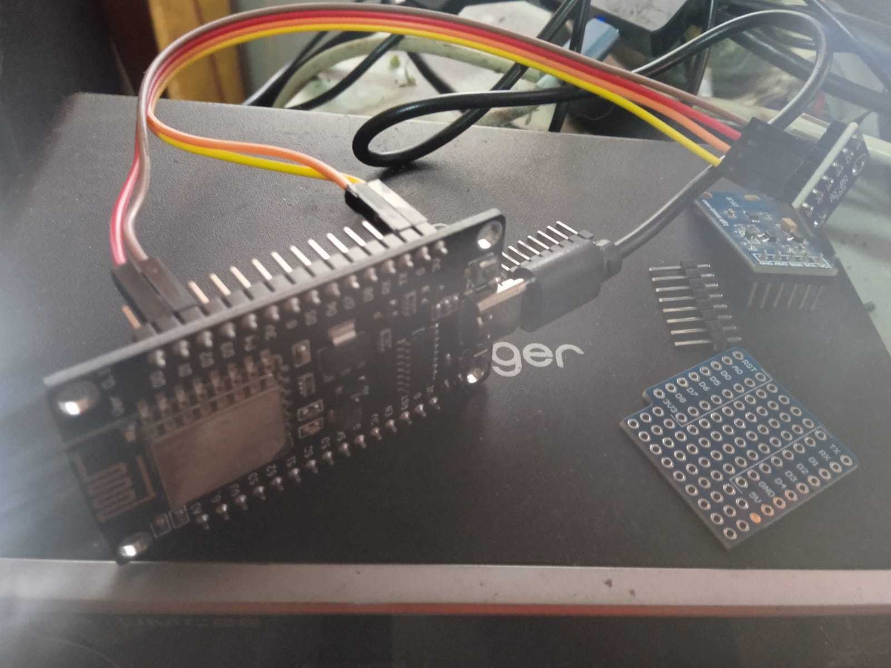

Estoy construyendo un sistema simple para medir temperatura, humedad y presión usando una ESP32 y un sensor BME280.

La idea no es hacer un proyecto “bonito”, sino algo que funcione, se mantenga y pueda escalar.

---

## Qué hace

- mide temperatura, humedad y presión  
- envía datos cada 1 minuto  
- guarda la información en una base de datos (Supabase)  

Es básicamente un nodo IoT mínimo.

---

## Hardware

- ESP32  
- sensor BME280  
- conexión WiFi  

Nada más.

---

## Flujo

1. la ESP32 se conecta a WiFi  
2. lee los datos del sensor  
3. envía los datos a la API  
4. espera 1 minuto  
5. repite  

---

## Decisiones

- usar intervalos fijos (simple > complejo)  
- enviar datos directo desde el dispositivo  
- evitar lógica innecesaria en el microcontrolador  

---

## Problemas encontrados

- reconexión WiFi inestable  
- necesidad de manejar errores (timeouts, fallos de envío)  
- código inicial desordenado  

Esto me llevó a reiniciar el proyecto desde cero para estandarizarlo.

---

## Próximos pasos

- mejorar reconexión automática  
- estructurar mejor el código  
- unificar este proyecto con otros dispositivos (ESP8266 / ESP32)  
- visualizar los datos  

---

## Notas

Este proyecto es más sobre el proceso que el resultado.

La idea es construir algo pequeño, pero que pueda crecer sin romperse.